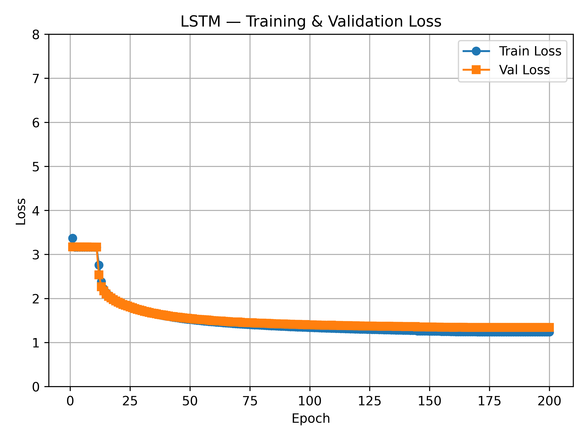
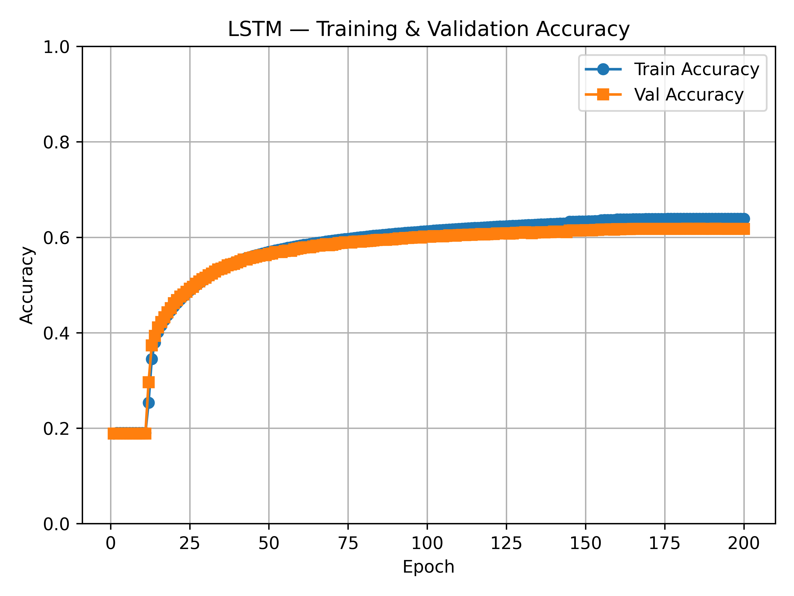

# LSTM Language Model

Character-level LSTM language model trained on WikiText-2.

---

## Results

**200 epochs · char-level · WikiText-2**

| Metric | Value |
|--------|-------|
| Validation accuracy | **61.78%** |
| Validation loss | 1.28 |




---

## Architecture

```
tokens → token embedding (128-dim)
       → embedding dropout (0.3)
       → 8 × LSTM layers (hidden=128, cuDNN)
       → output dropout (0.3)
       → linear head → next-character prediction
```

| Hyperparameter | Value |
|---|---|
| Embedding dim | 128 |
| Hidden dim | 128 |
| LSTM layers | 8 |
| Dropout | 0.3 |
| Sequence length | 128 chars |
| Batch size | 128 |
| Optimizer | Adam (lr=3e-4, weight decay=1e-5) |
| Scheduler | ReduceLROnPlateau (factor=0.5, patience=3, min_lr=1e-5) |
| Epochs | 200 |

---

## Repository Structure

```
LSTM/
├── train.py                  # Training script
├── requirements.txt          # Dependencies
├── checkpoints/
│   └── epoch_200_end.pt      # Trained model weights
├── loss_curve_lstm.png       # Training/validation loss
├── accuracy_curve_lstm.png   # Training/validation accuracy
├── data/
│   └── wikitext-2-raw/
│       ├── wiki.train.raw
│       ├── wiki.valid.raw
│       └── wiki.test.raw
└── src/
    ├── dataset.py            # CharDataset
    └── model/
        └── lstm_model.py     # LSTMLanguageModel
```

---

## Dataset

**WikiText-2 (raw)** — character-level language modeling.

| Split | Size |
|---|---|
| Training | ~12M characters |
| Validation | ~1M characters |
| Vocabulary | ~1,013 unique characters |

Each sample is a 128-character window; consecutive windows are non-overlapping (stride = seq_len).

Download with the Hugging Face `datasets` library:

```python
from datasets import load_dataset
import os

dataset = load_dataset("wikitext", "wikitext-2-raw-v1")
os.makedirs("data/wikitext-2-raw", exist_ok=True)

for split, fname in [("train", "wiki.train.raw"), ("validation", "wiki.valid.raw"), ("test", "wiki.test.raw")]:
    with open(f"data/wikitext-2-raw/{fname}", "w") as f:
        f.write("\n".join(dataset[split]["text"]))
```

---

## Installation

```bash
python3 -m venv venv
source venv/bin/activate
pip install -r requirements.txt
```

---

## Training

```bash
python train.py
```

The script resumes automatically from the latest checkpoint in `checkpoints/` if one exists.

During training it prints per-batch loss, saves checkpoints at mid-epoch and end-of-epoch, generates a short text sample each epoch, and saves loss/accuracy plots on completion.

---

## Loading the Trained Model

```python
import torch
from src.dataset import CharDataset
from src.model.lstm_model import LSTMLanguageModel

with open("data/wikitext-2-raw/wiki.train.raw") as f:
    train_text = f.read()

dataset = CharDataset(train_text, seq_len=128, stride=128)

model = LSTMLanguageModel(
    vocab_size=dataset.vocab_size,
    embed_dim=128,
    hidden_dim=128,
    num_layers=8,
    dropout=0.0,
)
ckpt = torch.load("checkpoints/epoch_200_end.pt", map_location="cpu", weights_only=False)
model.load_state_dict(ckpt["model_state"])
model.eval()

# Inference
text = "The market"
indices = [dataset.stoi[c] for c in text]
x = torch.tensor(indices).unsqueeze(0)
with torch.no_grad():
    logits = model(x)
next_char = dataset.itos[logits[0, -1].argmax().item()]
```

---

## Requirements

- Python ≥ 3.10
- CUDA-capable GPU recommended
- See `requirements.txt` for full dependency list
